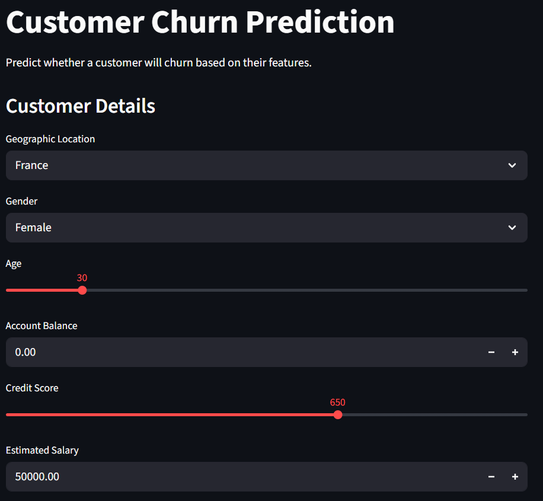
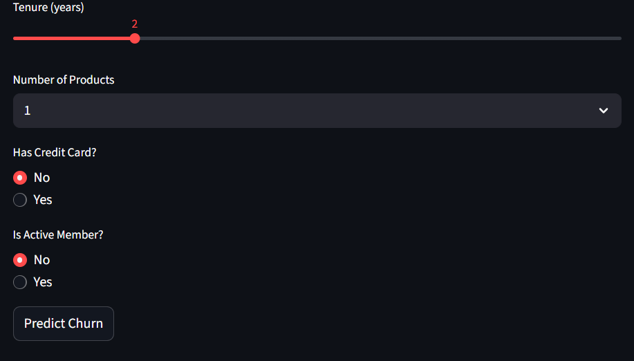
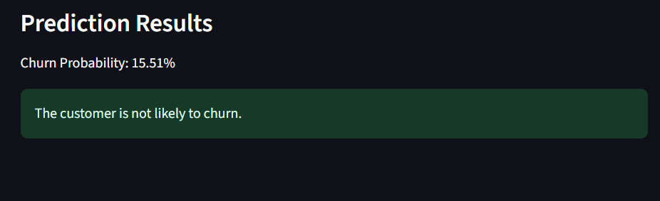

# Customer Churn Prediction App

This is a Streamlit web app that predicts whether a customer will churn or not using an Artificial Neural Network (ANN).

## Features
- Form-based user input
- Predicts churn probability
- Deployed on Streamlit Cloud (free)

## How to run locally
```bash
pip install -r requirements.txt
streamlit run app.py


# App picture




